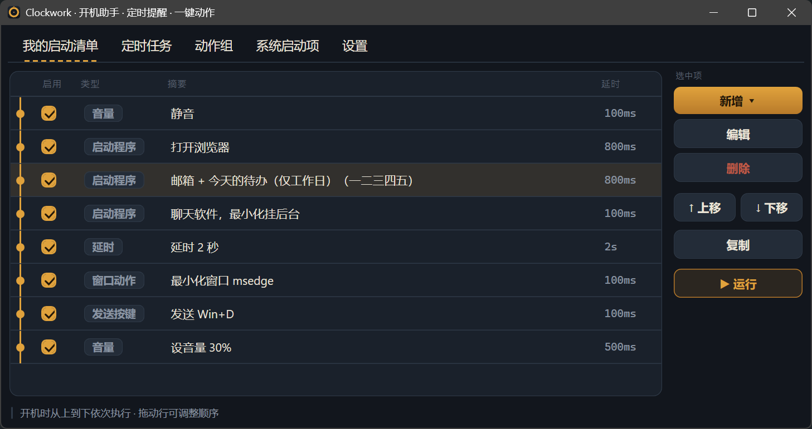

# Clockwork

**电脑上重复的事，自动帮你做**

开机自动开好软件 · 按时提醒 · 一键完成一串操作

**[⬇ 下载 Windows 版](https://github.com/rockbenben/Clockwork/releases/latest)** —— 绿色免安装，解压即用

 

[English](README.md) · **简体中文** · [繁體中文](docs/i18n/README.zh-Hant.md) · [日本語](docs/i18n/README.ja.md) · [한국어](docs/i18n/README.ko.md) · [Deutsch](docs/i18n/README.de.md) · [Español](docs/i18n/README.es.md) · [Français](docs/i18n/README.fr.md) · [Italiano](docs/i18n/README.it.md) · [Nederlands](docs/i18n/README.nl.md) · [Português](docs/i18n/README.pt.md) · [Русский](docs/i18n/README.ru.md) · [Türkçe](docs/i18n/README.tr.md) · [Tiếng Việt](docs/i18n/README.vi.md) · [ไทย](docs/i18n/README.th.md) · [Bahasa Indonesia](docs/i18n/README.id.md) · [हिन्दी](docs/i18n/README.hi.md) · [العربية](docs/i18n/README.ar.md)

## 它能做什么

- 🚀 **我的启动清单** —— 开机按顺序打开常用软件，每步可设延时、星期条件、窗口风格；顺路还能关窗口、切前台、静音。
- ⏰ **定时任务** —— 到点弹提醒（可朗读），或静默跑一个动作组。点「是」还能运行程序、打开文件 / 网页，或触发一个组。
- 🧹 **系统启动项** —— 把电脑里所有开机自启的东西列在一处：不需要的关掉（只禁用、不删除），或接管到自己的清单里。
- 🎛️ **动作组** —— 把一串动作打包成一套（专注 / 会议 / 收工 / 睡前……），从托盘、**全局热键**、启动清单或定时任务一键触发；内置模板可直接改。

> **随时叫停** —— 标签条右端的急停按钮（只在有东西在跑时出现）、托盘「停止正在运行的动作」，或全局急停键（默认 `Ctrl+Alt+Q`）。正在等的长延时会被当场打断，不用干等。

## 适用范围

| 方面 | 说明 |
| --- | --- |
| **系统** | Windows 10 / 11，x64 |
| **安装** | 不用装。单个 `Clockwork.exe` 自带 .NET 运行时，放哪个文件夹都行 |
| **管理员** | 只有「开机自启」和你自己勾了**以管理员运行**的步骤才需要 |
| **你的配置** | 就在 exe 旁边的 `clockwork.settings.json`（该目录不可写时自动落到 `%APPDATA%\Clockwork\`）——不联网、不外传 |
| **界面** | 18 种语言，首次运行跟随 Windows 显示语言 |

**已知限制。** 免安装也意味着没有自动更新——升级请下载新的 zip 覆盖 exe。沙箱 / 降权启动器会挡住发送按键、窗口动作、已运行则激活、音量这些底层调用（会给明确提示，单纯「启动程序」不受影响）。按键重映射与文本展开不在本工具范围内——那是 AutoHotkey 的强项。

## 怎么开始用

1. 到 [Releases](https://github.com/rockbenben/Clockwork/releases) 下载最新的 `Clockwork-<版本号>.zip`，解压出单个 `Clockwork.exe`，放进任意文件夹。
2. 双击打开设置窗口。首次载入的示例**全都没勾选**——你不勾，什么都不会跑。
3. 想每次开机自动运行：到**设置**页勾选**开机自启**（以管理员权限注册计划任务，开机不会弹一堆授权框）。

之后它就待在托盘里：双击托盘图标打开窗口，点窗口的关闭按钮只是收回托盘。彻底退出用托盘右键的**退出**。

> [!IMPORTANT]
> **程序没有做代码签名**，首次运行 SmartScreen 会弹「已保护你的电脑」——点**更多信息 → 仍要运行**。部分杀毒软件也可能报警：写注册表 Run 键和计划任务，既是启动管理器该干的事，也是恶意软件常干的事，从外部无法区分。不想凭信任接受的话，[自己编译一份](CONTRIBUTING.md)——结果一样，二进制是你自己的。

**详细使用说明** —— 每个字段、每个边角情况：[English](docs/USAGE.md) · [中文](docs/USAGE.zh.md)

## 小提示

- **双击条目即编辑**。路径 / 进程 / 组合键 / 日期都不用硬记：**「浏览…」「选择…」**（带搜索的进程选择器）**「捕获」「选日期」**。
- **拖动一行即可调整顺序** —— 三个列表和动作组编辑器的步骤列表都支持，上下移按钮照样能用。
- **保存前先试跑** —— 动作组编辑器里的 **▶ 运行这一步** 和 **▶ 运行整组**，跑的都是屏幕上此刻的内容，运行时按钮会变成 **■ 停止**。
- **「复制」**在选中项下方克隆一份，比重建一条相近的快；**删除一律先确认**，处处如此。
- 双击 `Clockwork.exe` 只是打开窗口，**不会**重跑启动清单；要跑用托盘的**重新运行启动清单**。

## 关于 365 开源计划

[365 开源计划](https://github.com/rockbenben/365opensource) 的第 **#020** 个项目——一个人 + AI，一年 300+ 个开源项目。

[提交你的需求 →](https://365.aishort.top/) · [Discord](https://discord.gg/PZTQfJ4GjX) · [Telegram](https://t.me/aishort_top)
