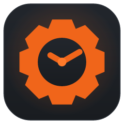
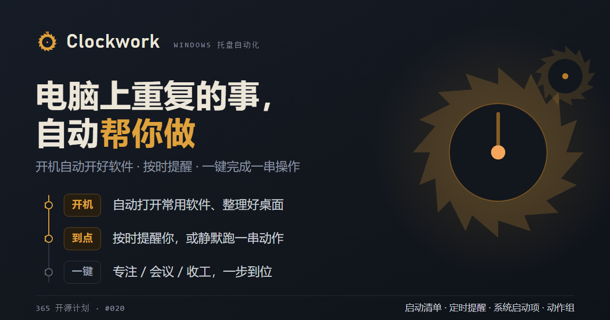
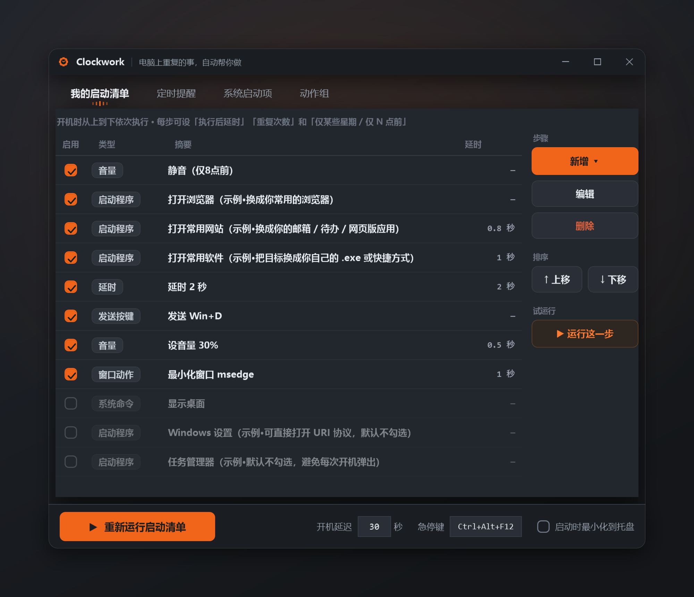

<div align="center">



# Clockwork

**PC의 반복 작업을 자동 운항으로**

로그인 시 앱 자동 실행 · 시간 지정 알림 · 한 번의 탭으로 전체 루틴 실행

</div>

<div align="center">

[English](../README.md) · [简体中文](README.zh-CN.md) · [繁體中文](README.zh-TW.md) · [日本語](README.ja.md) · **한국어** · [Deutsch](README.de.md) · [Español](README.es.md) · [Français](README.fr.md) · [Italiano](README.it.md) · [Nederlands](README.nl.md) · [Português](README.pt.md) · [Русский](README.ru.md) · [Türkçe](README.tr.md) · [Tiếng Việt](README.vi.md) · [ไทย](README.th.md) · [Bahasa Indonesia](README.id.md) · [हिन्दी](README.hi.md) · [العربية](README.ar.md)

</div>

> 365 오픈소스 계획 #020 · Windows 트레이 도구: 시작 프로그램 실행기 · 알림 · 시스템 시작 항목 · 액션 그룹



컴퓨터 앞에서 하루를 시작할 때의 반복적인 일들을 대신 처리해 주는 작은 Windows 트레이 도구입니다:

- 🚀 **시작 목록** — 로그인 시 매일 쓰는 앱을 순서대로 자동으로 열고(단계별 관리자 권한, 지연, 특정 요일만 / N시 이전만, 창 스타일, 실행 중이면 활성화, 대체 경로 설정 가능), 지나는 김에 몇 가지 잡일도 처리합니다(창 닫기 또는 포커스, 키 입력 / 텍스트 전송, 볼륨 설정…).
- ⏰ **알림** — 정시에 알림을 띄우고; 소리 내어 읽어 주며; 요일 / N일마다 / 매월 반복하거나; "로그인 시" 트리거합니다. **예**를 클릭하면 프로그램 실행, 파일(예: 음악)이나 URL 열기, 또는 액션 그룹 실행이 가능합니다.
- 🧹 **시스템 시작 항목** — **PC에서 자동으로 시작되는 모든 항목**을 나열하고 필요 없는 것을 끕니다(삭제가 아니라 비활성화 — 언제든 되돌릴 수 있음). 클릭 한 번으로 항목을 "인계받아" 자신의 시작 목록으로 가져옵니다.
- 🎛️ **액션 그룹** — 일련의 동작을 재사용 가능한 그룹으로 묶어(집중 / 회의 / 마무리 / 취침…), 트레이·시작 목록·알림에서 클릭 한 번으로 트리거합니다. 기본 제공 템플릿 포함.

설치 불필요, 완전히 이동 가능한 단일 폴더, 모든 것을 마우스로 설정 가능; 다크 UI, 고 DPI 지원.

## 요구 사항

- Windows 10 / 11 (x64)
- 설치할 것 없음: .NET 런타임이 내장된 자체 포함 단일 파일 `Clockwork.exe`.

## 시작하기

1. [Releases](https://github.com/rockbenben/Clockwork/releases)에서 최신 `Clockwork.exe`를 내려받아 아무 폴더에나 두세요(이동 가능 — 어디에 두든 상관없음). 직접 빌드하려면 아래 **개발자용**을 참조하세요.
2. **`Clockwork.exe`**를 더블클릭해 설정 창을 엽니다.
   - **첫 실행** 시 **샘플 설정**(시작 / 알림 / 액션 그룹 시연)이 로드되므로 자신에게 맞게 고칠 수 있습니다. 설정은 exe 옆의 `clockwork.settings.json`에 저장됩니다 — 로컬 전용이며 절대 커밋되지 않습니다.
3. 부팅할 때마다 실행하려면: **설정** 탭에서 **로그인 시 시작**을 클릭하세요(관리자 권한으로 예약 작업을 등록하므로 부팅 시 UAC 프롬프트가 잔뜩 뜨지 않습니다).

> 조용히 트레이에 머무릅니다. 트레이 아이콘을 더블클릭하면 창이 열립니다; 창의 닫기 버튼은 트레이로 숨길 뿐입니다. 완전히 종료하려면 트레이 아이콘을 우클릭해 **종료**를 사용하세요.

## 스크린샷



## 다섯 개의 탭

### 시작 목록
로그인 시 위에서 아래로 실행되는 **순서가 있는 단계 목록**입니다. **추가 ▾**를 클릭해 유형을 선택하고; 자유롭게 추가 / 제거 / 재정렬할 수 있으며; 각 단계는 활성화 / 비활성화하고, **단계 후 지연**, **반복 횟수**(N회 반복), 조건(**특정 요일만 / N시 이전만**)을 지정할 수 있습니다. 단계 유형:

- **프로그램 실행** — 대상(**찾아보기…**로 파일 선택) / 인수 / 작업 디렉터리(비워 두면 = 대상의 폴더) / 관리자. 대상은 `.exe`, 문서, 바로 가기 또는 URL일 수 있으며; `.ps1`은 PowerShell로 실행됩니다. 고급: **창 스타일**(최소화 / 최대화 / 숨김), **이미 실행 중이면 활성화**(재실행 대신 앞으로 가져오기; 프로세스 이름은 **선택…**으로), **대체 경로**(한 줄에 하나의 전체 경로; 처음으로 존재하는 것이 사용됨 — 컴퓨터마다 설치 경로가 다를 때 편리).
- **키 전송** — 예: Win+D, Alt+K, Ctrl+Enter, F5(**캡처**로 단축키를 직접 눌러 기록).
- **텍스트 전송** — 포커스된 창(또는 **선택…**으로 고른 **대상 프로세스**)에 문자열을 입력.
- **볼륨** — 음소거 / 음소거 해제 / 레벨 설정.
- **창 동작** — 프로세스 이름으로(**선택…**, 검색 가능): 닫기 / 최소화 / 최대화 / 앞으로 가져오기 / 앞으로 가져와 키 전송; 느린 앱은 **창이 나타날 때까지 최대 N초 대기**할 수 있습니다.
- **시스템 명령** — 바탕 화면 보기 / 잠금 / 모니터 끄기 / 휴지통 비우기 / 클립보드 지우기 / 설정 열기 / 작업 관리자 / 스크린샷 / 절전 / 최대 절전 모드 / 로그아웃 / 다시 시작 / 종료(마지막 세 개는 먼저 확인함).
- **지연** — 다음 단계 전에 단순히 N초 대기.
- **액션 그룹** — 정의된 액션 그룹을 실행; 반복 횟수를 설정하면 그룹 전체를 반복합니다.

> **시작 지연**(설정 탭, 부팅 시에만): 로그인 후 정해진 초만큼 대기하여 "로그인 폭풍"(모든 자동 시작으로 인한 디스크 / CPU 경합)이 지나간 뒤 목록을 실행합니다; 수동 재실행에는 영향을 주지 않습니다. 너무 일찍 시작되면 올리세요(0–600초).

> **언제든 중지** — 트레이 → **실행 중인 동작 중지**, 또는 전역 **긴급 정지 단축키**(설정 탭에서 지정; 기본값 `Ctrl+Alt+Q`). 실행 중인 것은 현재 동작이 끝난 뒤 중지됩니다; 긴 대기(시작 지연, 창 대기)는 즉시 중단됩니다.

### 알림
**시간**(또는 **로그인 시**로 전환), **반복**(요일 / N일마다 / 매월), **텍스트**를 설정하고; 선택적으로 소리 내어 읽어 줍니다. **"예" 동작**(프로그램 실행 / 파일 열기 / URL / 액션 그룹 실행)이 있는 알림은 **다시 알림** 버튼이 있는 **예 / 아니요** 대화 상자를 띄웁니다(기본 10분, ▾ 메뉴로 5–60분); 나머지는 구석에 **알림 카드**로 미끄러져 들어옵니다(설정한 초 후 자동으로 닫힘, **0 = 직접 닫을 때까지 유지**). **무음 액션 그룹**도 설정할 수 있습니다 — 팝업 없이 정시에 그룹을 실행.

고급: **자동 닫기**, **반복 재촉**(마감까지 N분마다 다시 띄움), **트리거 후 지연 + 무작위 지터**, **유예**(짧은 종료 / 절전으로 놓친 발화를 잡음), **놓치면 따라잡기**(최대 절전 / 종료로 건너뛴 뒤 한 번 다시 발화), 그리고 N일마다를 위한 **기준 날짜**(**날짜 선택**). "오늘 발화됨"과 "다시 알림 예약 시각"은 다시 시작해도 유지되므로(`clockwork.state.json`), 다시 알림은 재시작을 넘어 이어지고 이중 발화도 없습니다.

집중하거나 회의에 들어가야 하나요? 트레이는 **알림 1 / 2 / 4시간 일시 중지**(방해 금지)를 제공합니다: 모든 것(무음 그룹 포함)이 억제되고 시간이 되면 자동으로 재개됩니다.

### 시스템 시작 항목
**자동으로 시작되는 모든 항목**을 나열합니다(레지스트리 Run 키, 시작 폴더, 예약 작업). **사용** 체크를 해제하면 항목을 끕니다 — **삭제가 아니라 비활성화; 다시 체크하면 복원**(즉시 적용). **관리자 필요**로 표시된 항목은 권한을 상승하여 다시 실행하도록 안내합니다. 시스템 / 정책 / 일회성 항목(그룹 정책 Run, RunOnce, Winlogon, Active Setup)은 일반적인 방법으로 전환할 수 없으며 **기본적으로 숨겨져** 있습니다 — **시스템 / 읽기 전용 항목 표시**에 체크하면 볼 수 있습니다(회색으로 표시). **시작 목록으로 인계**는 항목을 Clockwork에 넘깁니다(레지스트리 Run 키와 시작 폴더 항목만). 상단의 **필터**는 이름 / 명령으로 검색합니다; 잘린 명령 위에 마우스를 올리면 전체를 읽을 수 있습니다.

### 액션 그룹
동작을 재사용 가능한 그룹으로 묶습니다. **추가 ▾**는 **기본 제공 템플릿**(집중 / 회의 / 마무리 / 취침 / 자리 비움 / 스크린샷)에서 시작합니다 — 프로세스 이름을 조정하고 저장하기만 하면 됩니다. 그룹은 **동작을 정의할 뿐**입니다; 세 가지 방법으로 트리거합니다: 트레이에서(**실행: <그룹>**), 시작 목록의 **액션 그룹 단계**로(부팅 시), 또는 알림에서(**"예" / 무음 그룹**). 한 그룹은 한 번에 하나만 실행됩니다; **메시지** 단계는 확인 관문 역할을 할 수 있습니다(**아니요**로 답하면 나머지가 중단됨).

### 설정
**시작 지연**(0–600초, 부팅 시에만), **시작 시 트레이로 최소화**, **긴급 정지 단축키**(상자를 클릭하고 단축키를 누름; Esc로 취소, Delete로 지움; 기본값 `Ctrl+Alt+Q`), 그리고 **UI 언어**(간체 중국어, English, 日本語 외 — 총 18종; 전환하면 적용을 위해 앱이 다시 시작됨).

## 팁

- **행을 더블클릭해 편집**하세요. 경로 / 프로세스 / 단축키 / 날짜를 채울 때 손으로 입력할 필요가 없습니다: **찾아보기…**, **선택…**(검색 가능한 프로세스 선택기), **캡처**, **날짜 선택**이 있습니다.
- `Clockwork.exe`를 더블클릭하는 것은 설정만 열 뿐이며, 시작 목록을 즉시 실행하지 **않습니다**; 실행하려면 트레이의 **시작 목록 다시 실행**을 사용하세요.
- **정상적으로 실행하세요**(더블클릭 / 트레이 / 예약 작업). 일부 샌드박스 / 권한을 낮춘 실행기는 저수준 호출을 차단하므로 키 전송 / 창 동작 / 실행 중이면 활성화 / 프로세스로 텍스트 전송 / 볼륨이 작동하지 않을 수 있습니다(명확한 안내가 표시됩니다; 단순한 "프로그램 실행"은 영향을 받지 않습니다).
- 설정은 `clockwork.settings.json`(로컬 전용)입니다. 삭제하면 샘플로 초기화됩니다. 알림 상태는 `clockwork.state.json`(역시 로컬; 삭제해도 안전)입니다.
- `.ahk` 단계를 추가하려면 AutoHotkey가 설치되어 있어야 합니다. 전역 단축키 / 텍스트 확장은 범위 밖입니다 — 그것은 AutoHotkey의 강점입니다.

## 개발자용

C#/.NET WPF; 소스는 `app/`(.NET 10 SDK 필요). 레이어: `Core/` 순수 로직 · `Native/` Win32 상호 운용 · `Engine/` 실행 · `ViewModels/` + `Views/` UI · `I18n/` + `Resources/` 지역화(중립 = 중국어 소스, 언어마다 하나의 `Strings.<code>.resx` 새틀라이트).

- 테스트 실행(xUnit):
  ```powershell
  dotnet test app.Tests/Clockwork.Tests.csproj
  ```
- 자체 포함 단일 파일 exe 빌드(단일 파일 / 자체 포함 / 압축은 csproj에 설정됨):
  ```powershell
  dotnet publish app/Clockwork.csproj -c Release -r win-x64
  ```
  출력: `app/bin/Release/net10.0-windows/win-x64/publish/Clockwork.exe`.
- **CI / 릴리스**(GitHub Actions): push / PR은 Windows 러너에서 빌드하고 모든 테스트를 실행합니다; `v*` 태그(예: `v2.0.0`)를 push하면 빌드하고, 태그에서 파일 버전을 새기고, GitHub Release를 만들어 `Clockwork.exe`를 첨부합니다.

## 365 오픈소스 계획에 대하여

이것은 [365 오픈소스 계획](https://github.com/rockbenben/365opensource)의 20번째 프로젝트입니다 — 한 사람 + AI가 1년에 300개 이상의 오픈소스 프로젝트를. [요청 보내기 →](https://my.feishu.cn/share/base/form/shrcnI6y7rrmlSjbzkYXh6sjmzb)

## 라이선스

[MIT](../LICENSE) © rockbenben
