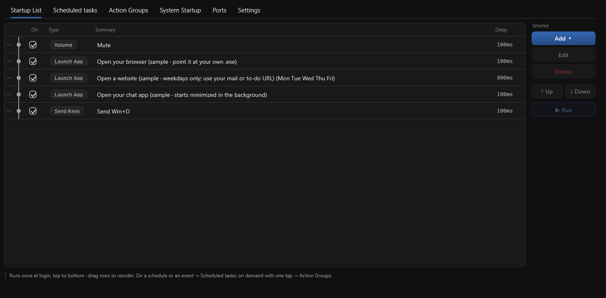

# Clockwork

**Mettez en pilote automatique les tâches répétitives de votre PC**

Lancez vos applications automatiquement à l'ouverture de session · rappels programmés · une seule pression pour exécuter toute une routine

**[⬇ Télécharger pour Windows](https://github.com/rockbenben/Clockwork/releases/latest)** — portable, sans installation

 

[English](../../README.md) · [简体中文](../../README.zh.md) · [繁體中文](README.zh-Hant.md) · [日本語](README.ja.md) · [한국어](README.ko.md) · [Deutsch](README.de.md) · [Español](README.es.md) · **Français** · [Italiano](README.it.md) · [Nederlands](README.nl.md) · [Português](README.pt.md) · [Русский](README.ru.md) · [Türkçe](README.tr.md) · [Tiếng Việt](README.vi.md) · [ไทย](README.th.md) · [Bahasa Indonesia](README.id.md) · [हिन्दी](README.hi.md) · [العربية](README.ar.md)

## Ce qu'il fait

- 🚀 **Liste de démarrage** — ouvre vos applications de tous les jours dans l'ordre à l'ouverture de session, avec délai, condition de jour et style de fenêtre par étape ; ferme, met au premier plan ou coupe le son en chemin. Les étapes peuvent aussi dépendre de l'état de la machine : seulement si une application tourne (ou pas), seulement sur secteur ou seulement sur batterie, seulement si un fichier ou un dossier existe.
- ⏰ **Tâches planifiées** — un rappel à l'heure, lu à voix haute si vous voulez, ou un groupe d'actions exécuté en silence. Cliquer sur **Oui** peut lancer un programme, ouvrir un fichier ou une URL, ou déclencher un groupe. Ou un événement peut déclencher à la place de l'horloge — au déverrouillage, au verrouillage, à la sortie de veille, après N minutes d'inactivité, au branchement ou débranchement du secteur, ou en cas de batterie faible. Besoin d'un rappel unique, tout de suite ? La zone de notification propose un **rappel rapide** — de 5 à 60 minutes, il sonne une fois puis se supprime.
- 🧹 **Éléments de démarrage du système** — tout ce qui démarre automatiquement sur votre PC, dans une seule liste : désactivez ce dont vous n'avez pas besoin (désactivé, pas supprimé) ou récupérez-le dans votre propre liste.
- 🎛️ **Groupes d'actions** — regroupez une routine (Concentration / Réunion / Clôture / Coucher…) et déclenchez-la depuis la barre d'état système, un **raccourci global**, la liste de démarrage ou une tâche planifiée. Modèles inclus.

> **Arrêtez à tout moment** — le bouton d'arrêt à droite de la barre d'onglets (visible uniquement pendant une exécution), zone de notification → **Arrêter les actions en cours**, ou le raccourci d'arrêt d'urgence global (par défaut `Ctrl+Alt+Q`). Les longues attentes sont coupées court, pas subies.

## Prérequis

| Aspect | Détail |
| --- | --- |
| **Système** | Windows 10 / 11, x64 |
| **Installation** | Aucune. Un seul `Clockwork.exe` portable — déposez-le dans n'importe quel dossier |
| **Droits admin** | Uniquement pour « Démarrer à l'ouverture de session » et pour les étapes que vous marquez **exécuter en administrateur** |
| **Vos réglages** | `clockwork.settings.json` à côté de l'exe (ou `%APPDATA%\Clockwork\` si ce dossier est en lecture seule) — rien ne quitte la machine |
| **Interface** | 18 langues, suivant la langue d'affichage de Windows au premier lancement |

**Limites.** Sans installateur, pas de mise à jour automatique — téléchargez le nouveau zip et remplacez l'exe. Les lanceurs en bac à sable bloquent l'envoi de touches, les actions de fenêtre, activer-si-déjà-lancé et le volume (vous recevez un avertissement clair ; le simple « lancer un programme » fonctionne toujours). Le remappage de touches et l'expansion de texte restent hors périmètre — c'est le travail d'AutoHotkey.

## Prise en main

1. Téléchargez la dernière version depuis [Releases](https://github.com/rockbenben/Clockwork/releases) — deux builds, trois téléchargements — et déposez l'unique `Clockwork.exe` obtenu dans n'importe quel dossier.
   - **`Clockwork-<version>-win-x64.zip`** — runtime .NET inclus, tourne tel quel sur n'importe quel Windows 10/11. À prendre en cas de doute, ou si le PC est hors ligne ou verrouillé.
   - **`Clockwork-<version>-win-x64-needs-dotnet10.zip`** — exige le [runtime de bureau .NET 10](https://dotnet.microsoft.com/download/dotnet/10.0) installé. Installez-le une fois sur un PC connecté, ensuite chaque mise à jour ne pèse presque rien.
   - **`Clockwork.exe`** — le même build que le zip ci-dessus, sans le zip : cliquez, lancez, ou écrasez votre copie existante pour mettre à jour. Si le runtime manque, Windows en propose le téléchargement.
2. Double-cliquez dessus pour ouvrir la fenêtre des paramètres. Les exemples chargés sont tous **décochés** — rien ne s'exécute tant que vous ne les cochez pas.
3. Pour le lancer à chaque démarrage : dans l'onglet **Paramètres**, cochez **Démarrer à l'ouverture de session** (enregistre une tâche planifiée avec droits d'administrateur, donc pas de déluge d'invites UAC au démarrage).

Il reste ensuite dans la barre d'état système : double-cliquez sur l'icône pour ouvrir la fenêtre, et le bouton de fermeture ne fait que la masquer à nouveau. Pour quitter vraiment, utilisez **Quitter** dans le clic droit de la barre.

> [!IMPORTANT]
> **L'exe n'est pas signé**, donc SmartScreen affiche « Windows a protégé votre ordinateur » au premier lancement — cliquez sur **Informations complémentaires → Exécuter quand même**. Un antivirus peut aussi réagir : écrire des clés Run du registre et des tâches planifiées, c'est exactement le travail d'un gestionnaire de démarrage — et aussi ce que fait un logiciel malveillant ; de l'extérieur, rien ne les distingue. Si vous préférez ne pas l'accepter sur parole, [compilez-le vous-même](../../CONTRIBUTING.md) — même résultat, votre propre binaire. Chaque release inclut aussi un `SHA256SUMS.txt` et une attestation de build GitHub : `gh attestation verify <fichier> -R rockbenben/Clockwork` prouve que le téléchargement a été compilé par la CI de ce dépôt, pas sur l'ordinateur de quelqu'un.

**Guide complet** — chaque champ, chaque cas limite : [English](../USAGE.md) · [中文](../USAGE.zh.md)

## Astuces

- **Double-cliquez sur une ligne pour la modifier**. Les chemins, processus et dates ne se saisissent pas à la main : **le bouton … en bout de ligne** ouvre le sélecteur correspondant (fichier, liste de processus avec recherche, date), et les raccourcis s'enregistrent en les pressant via **Capturer**.
- **Faites glisser une ligne pour la réordonner** — dans les trois listes et dans la liste des étapes de l'éditeur de groupe ; les boutons haut/bas fonctionnent toujours.
- **Essayez avant d'enregistrer** — **▶ Exécuter cette étape** et **▶ Exécuter le groupe** dans l'éditeur de groupe exécutent ce qui est actuellement à l'écran, et le bouton devient **■ Arrêter** pendant l'exécution.
- **Dupliquer** clone la tâche ou le groupe sélectionné juste en dessous — plus rapide que de refaire une ligne presque identique. **La suppression demande toujours confirmation**, partout.
- Double-cliquer sur `Clockwork.exe` ouvre seulement la fenêtre ; cela **n'**exécute **pas** à nouveau la liste de démarrage. Pour cela, utilisez **Réexécuter la liste de démarrage** de la barre d'état système.

## À propos du 365 Open Source Plan

Projet **#020** du [365 Open Source Plan](https://github.com/rockbenben/365opensource) — une personne + l'IA, plus de 300 projets open source en un an.

[Proposez votre idée →](https://365.aishort.top/) · [Discord](https://discord.gg/PZTQfJ4GjX) · [Telegram](https://t.me/aishort_top)
