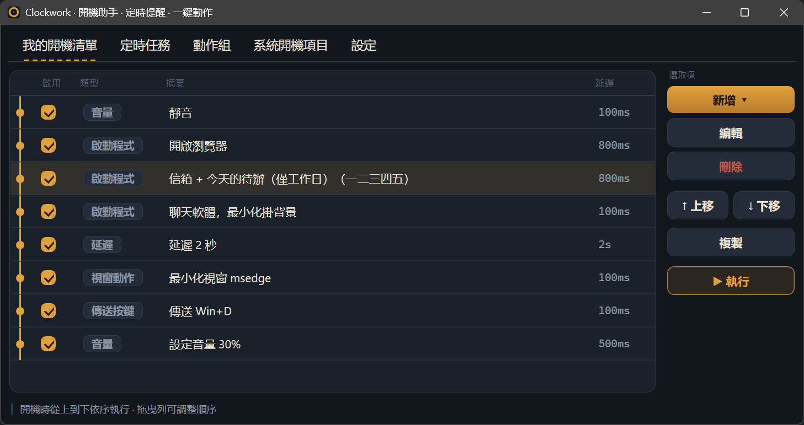

# Clockwork

**讓電腦上重複性的雜事自動運行**

登入時自動啟動應用程式 · 定時提醒 · 一鍵執行整套流程

**[⬇ 下載 Windows 版](https://github.com/rockbenben/Clockwork/releases/latest)** —— 免安裝，解壓即用

 

[English](../../README.md) · [简体中文](../../README.zh.md) · **繁體中文** · [日本語](README.ja.md) · [한국어](README.ko.md) · [Deutsch](README.de.md) · [Español](README.es.md) · [Français](README.fr.md) · [Italiano](README.it.md) · [Nederlands](README.nl.md) · [Português](README.pt.md) · [Русский](README.ru.md) · [Türkçe](README.tr.md) · [Tiếng Việt](README.vi.md) · [ไทย](README.th.md) · [Bahasa Indonesia](README.id.md) · [हिन्दी](README.hi.md) · [العربية](README.ar.md)

## 它能做什麼

- 🚀 **啟動清單** —— 登入時依序開啟你每天要用的應用程式，每步可設延遲、星期條件與視窗樣式；順手還能關閉、聚焦或靜音。
- ⏰ **定時任務** —— 準時彈出提醒（想要的話還能朗讀），或靜默執行一個動作群組。點 **是** 可以執行程式、開啟檔案或網址，或觸發一個群組。
- 🧹 **系統開機自啟項** —— 電腦上所有會自動啟動的項目集中成一張清單：把不需要的關掉（是停用，不是刪除），或接管進你自己的啟動清單。
- 🎛️ **動作群組** —— 把一套流程打包（專注 / 會議 / 收尾 / 就寢……），從系統匣、**全域熱鍵**、啟動清單或定時任務觸發。內建範本可用。

> **隨時叫停** —— 標籤列右端的停止按鈕（只在有東西執行時出現）、系統匣 →**停止正在執行的動作**，或全域緊急停止熱鍵（預設 `Ctrl+Alt+Q`）。漫長的等待會被當場切斷，不必等它跑完。

## 系統需求

| 項目 | 內容 |
| --- | --- |
| **系統** | Windows 10 / 11，x64 |
| **安裝** | 不需要。一個內含 .NET 執行環境的 `Clockwork.exe`——丟進任何資料夾即可 |
| **管理員權限** | 只有「登入時啟動」和你標記為**以系統管理員執行**的步驟才需要 |
| **你的設定** | exe 旁的 `clockwork.settings.json`（該資料夾唯讀時改用 `%APPDATA%\Clockwork\`）——不會離開這台電腦 |
| **介面** | 18 種語言，首次執行跟隨 Windows 顯示語言 |

**已知限制。** 免安裝也意味著沒有自動更新——請下載新的 zip 覆蓋 exe。沙箱 / 降權啟動器會擋住傳送按鍵、視窗動作、已在執行則啟動與音量（會給明確提示，單純「啟動程式」不受影響）。按鍵重新對應與文字展開不在本工具範圍內——那是 AutoHotkey 的強項。

## 開始使用

1. 從 [Releases](https://github.com/rockbenben/Clockwork/releases) 下載最新的 `Clockwork-<版本號>.zip`，解壓後把裡面單一的 `Clockwork.exe` 丟進任何資料夾。
2. 雙擊它開啟設定視窗。載入的範例**全都沒有勾選**——你不勾，就什麼都不會執行。
3. 想每次開機都執行：到 **設定** 分頁勾選 **登入時啟動**（會以系統管理員權限註冊排程工作，開機時不會冒出一堆 UAC 提示）。

之後它就待在系統匣：雙擊圖示開啟視窗，而視窗的關閉按鈕只是把它收回去。要真正結束，用系統匣右鍵的 **結束**。

> [!IMPORTANT]
> **這個 exe 沒有程式碼簽章**，所以首次執行時 SmartScreen 會顯示「已保護您的電腦」——點「其他資訊」→「仍要執行」。部分防毒軟體也可能報警，因為寫登錄檔 Run 機碼與排程工作，既是啟動管理器該做的事，也是惡意程式會做的事，從外部無從分辨。不想憑信任接受的話，[自己編譯一份](../../CONTRIBUTING.md)——結果一樣，執行檔是你自己的。

**完整說明** —— 每個欄位、每個邊界情況：[English](../USAGE.md) · [中文](../USAGE.zh.md)

## 小技巧

- **雙擊某一列即可編輯**。路徑、行程、快速鍵與日期都有人幫你填：**瀏覽…**、**挑選…**（可搜尋的行程挑選器）、**擷取**、**挑選日期**。
- **拖曳某一列即可調整順序** —— 三個清單與群組編輯器的步驟清單都支援；上移 / 下移按鈕照樣能用。
- **儲存前先試跑一遍** —— 群組編輯器的 **▶ 執行這一步** 與 **▶ 執行整組** 跑的都是畫面上此刻的內容，執行期間按鈕會變成 **■ 停止**。
- **複製** 會把選取的任務或群組複製到它正下方——比從頭重建一個幾乎一樣的快多了。**刪除一律會先詢問**，處處如此。
- 雙擊 `Clockwork.exe` 只會開啟視窗，**不會**重新執行啟動清單；要執行請用系統匣的 **重新執行啟動清單**。

## 關於 365 開源計劃

[365 開源計劃](https://github.com/rockbenben/365opensource) 的第 **#020** 個專案——一人 + AI，一年 300+ 個開源專案。

[提交你的點子 →](https://365.aishort.top/) · [Discord](https://discord.gg/PZTQfJ4GjX) · [Telegram](https://t.me/aishort_top)
